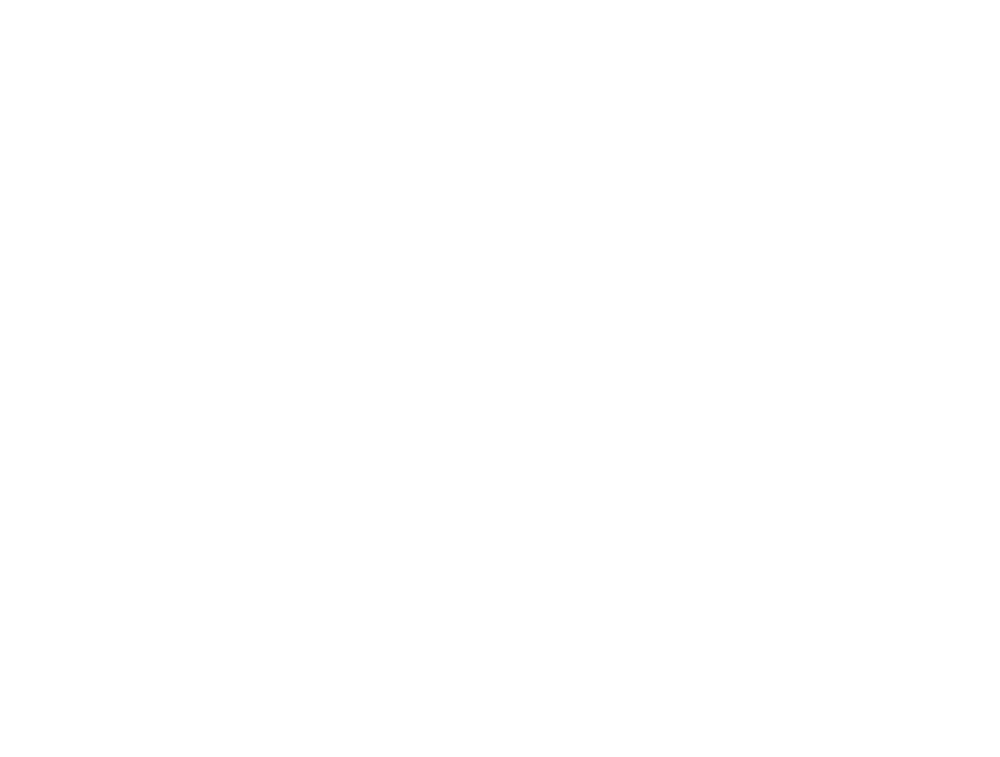
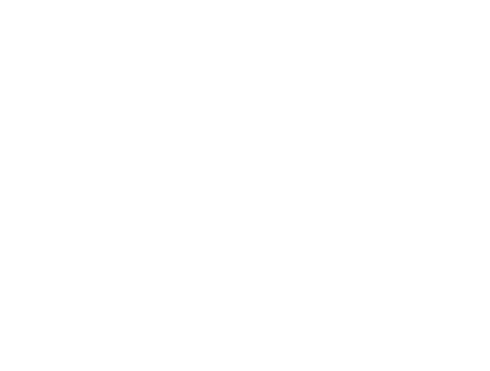

# Butterfly Species Classification

A deep learning project for butterfly species classification using transfer learning and computer vision techniques.

## Project Structure

```text
butterfly-classification/
│
├── data/
│   ├── raw/
│   └── processed/
│
├── notebooks/
│
├── src/
│
├── outputs/
│   ├── figures/
│   ├── models/
│   └── reports/
│
├── requirements.txt
├── README.md
├── .gitignore
└── LICENSE
```

## Objective

The goal of this project is to classify butterfly species from images using convolutional neural networks and transfer learning.

## Dataset Overview

- Dataset: Leeds Butterfly Dataset
- Images: 832
- Species: 10
- Image Resolution Used: 224 × 224

## Exploratory Data Analysis

### Class Distribution



### Sample Butterfly Images

