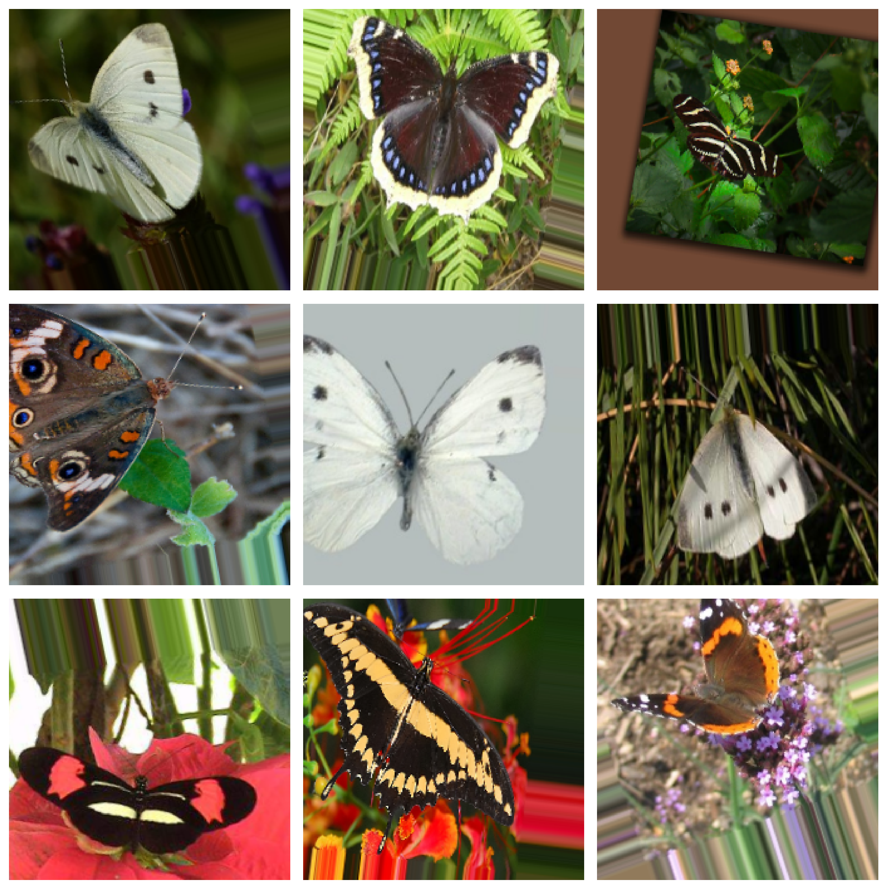
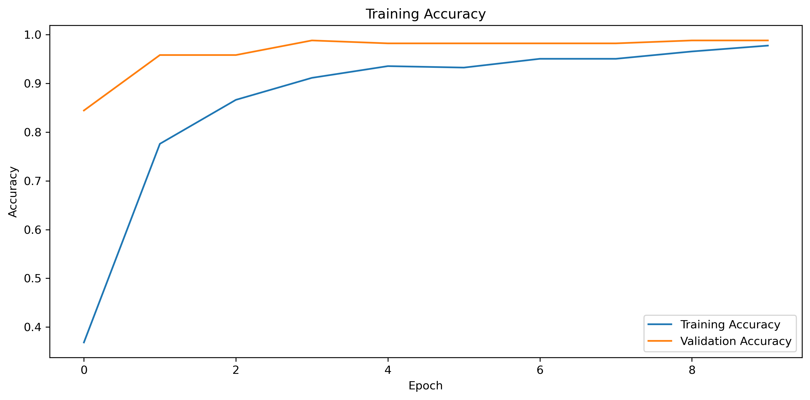
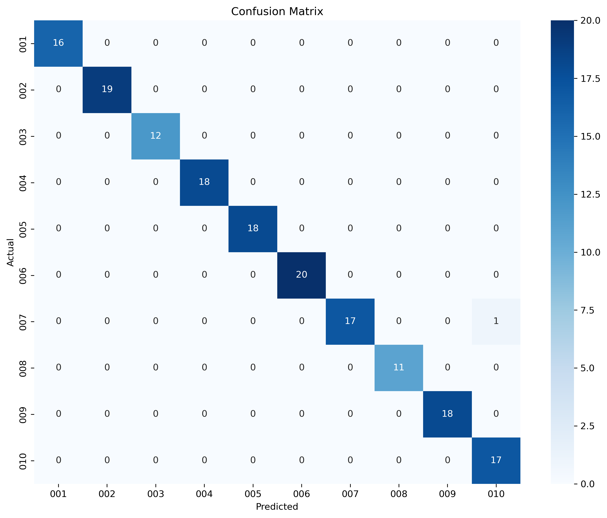

# 🦋 Butterfly Species Classification using Deep Learning


## Overview

This project builds an end-to-end deep learning pipeline for butterfly species classification using transfer learning and computer vision techniques.

A pretrained Xception network was fine-tuned on the Leeds Butterfly Dataset to classify images across 10 butterfly species. The project includes data preprocessing, exploratory data analysis, augmentation, model training, evaluation, and visualization.

---

## Dataset

**Dataset:** Leeds Butterfly Dataset

| Metric         | Value                 |
| -------------- | --------------------- |
| Total Images   | 832                   |
| Species        | 10                    |
| Image Size     | 224 × 224             |
| Split Strategy | Stratified Train/Test |

---

## Exploratory Data Analysis

### Species Distribution


### Sample Images


### Data Augmentation



The training pipeline applies:

* Random Rotation
* Horizontal Flip
* Zoom
* Width & Height Shift
* Shear Transform

---

## Model Architecture

### Transfer Learning with Xception

```text
Input Image (224x224x3)
        │
        ▼
Pretrained Xception
(ImageNet Weights)
        │
        ▼
Global Average Pooling
        │
        ▼
Dense (128, ReLU)
        │
        ▼
Dropout (0.5)
        │
        ▼
Softmax Output (10 Classes)
```

### Why Xception?

* State-of-the-art CNN architecture
* Pretrained on ImageNet
* Strong feature extraction capability
* Reduced training time through transfer learning
* Excellent performance on small datasets

---

## Training Configuration

| Parameter           | Value                    |
| ------------------- | ------------------------ |
| Optimizer           | Adam                     |
| Learning Rate       | 1e-4                     |
| Loss Function       | Categorical Crossentropy |
| Epochs              | 10                       |
| Batch Size          | 16                       |
| Early Stopping      | Yes                      |
| Model Checkpointing | Yes                      |

---

## Results

### Training Accuracy



### Confusion Matrix



### Final Performance

| Metric              | Score |
| ------------------- | ----- |
| Training Accuracy   | 96.7% |
| Validation Accuracy | 98.2% |
| Validation Loss     | 0.136 |

The model achieved strong classification performance across all butterfly species, demonstrating the effectiveness of transfer learning for image recognition tasks with limited data.

---

## Project Structure

```text
butterfly-classification/
│
├── data/
├── notebooks/
├── outputs/
│   ├── figures/
│   └── models/
├── src/
│
├── README.md
├── requirements.txt
```

---

## Key Features

* End-to-End Deep Learning Pipeline
* Transfer Learning with Xception
* Automated Data Preparation Pipeline
* Image Augmentation
* Training Visualization
* Confusion Matrix Analysis
* Model Checkpointing
* Modular Project Structure

---

## Future Improvements

* Grad-CAM visualizations
* Model deployment with Streamlit
* Real-time butterfly classification interface

---

## Author

Developed as a computer vision and deep learning project focused on transfer learning-based image classification.